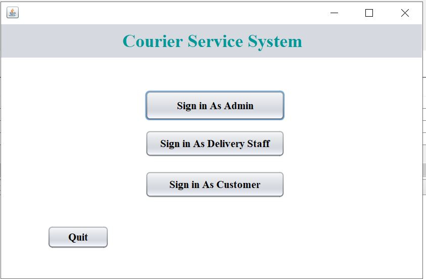
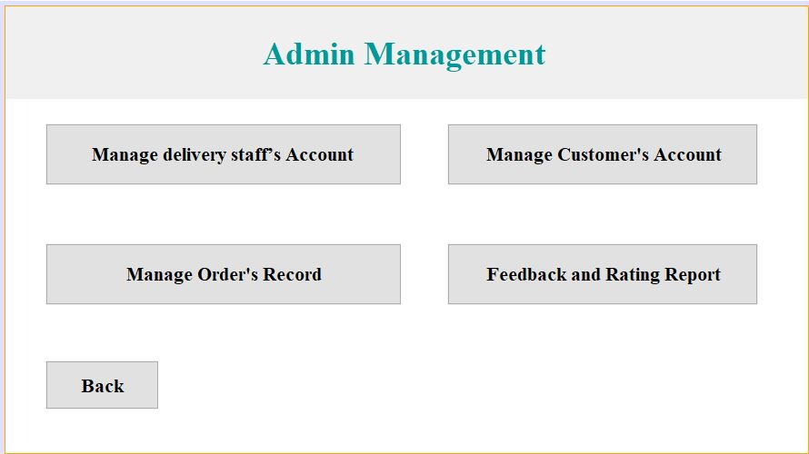
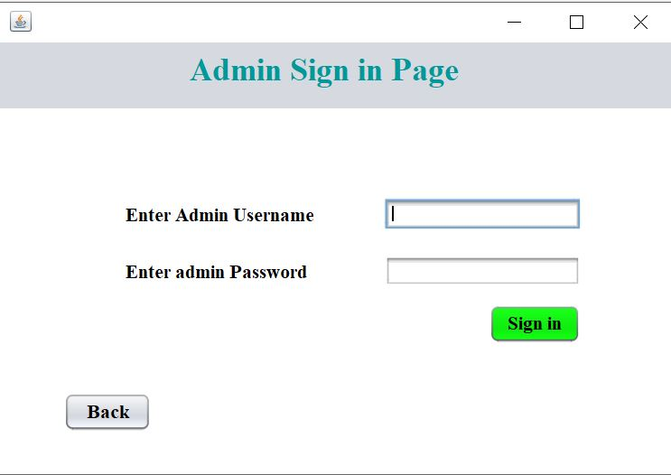
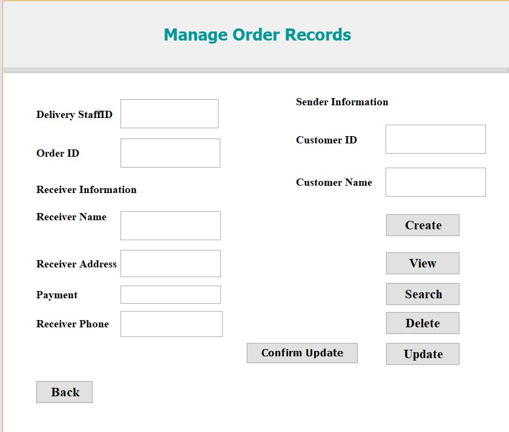
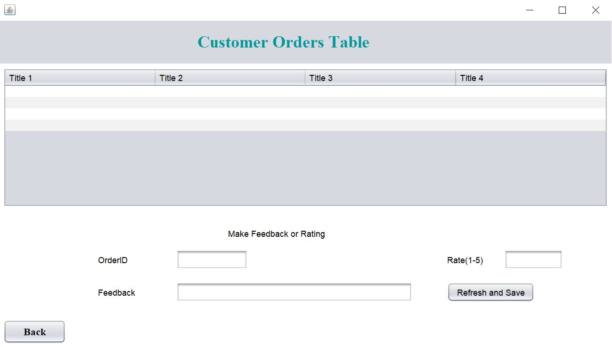

# Courier service system java

...............................Courier service system Desktop Application...................................
Courier service system Desktop Application designed to help the Courier service company to manage the courier service easily. The system allows the admin staff, delivery staff, and customer to access the available functionality for each one. 

App features: 
1. The app implemented with Text file.
2. The app can run on Windows OS.
3. The app implmented with authentication.
4. The app designed for three type of users.

Text file used: 
  1. authentaction: to create the admin account
  2. database: to store the accounts and events details

App funcationality:
1. Login Page for all users
screenshot
 

2. Admin user:
   a. admin dashboard
    
   
   b. admin login
     
    
   c. Manage customer accounts
    
   d. Manage delivery staff account
   
   d. Manage order records
    

3. Delivery staff:
   a. Deliver dahsboard
 
   b. manage assigned orders
     
    
    
   c. view my profile
   
   d. login
 
4. customer user:
   a. customer dahsboard
 
   b. my orders
     
    
   c. login
    
    
App limitations: 
 1. The app missing some features will be updated later
 2. The app GUI needs to be imporved 
 
  
 contact me for any question or feedback using the following contacts. 
 
 Email: ak_aldhafer@hotmail.com
 github: akaldhafer
 linkedin: https://www.linkedin.com/in/abdulmalek-aldhafer-206485173/
 instagram: https://www.instagram.com/ak_aldhafer
   
 follow our society as well for any project request or help. 
 https://www.instagram.com/asocietytech  
    
    
    
    

